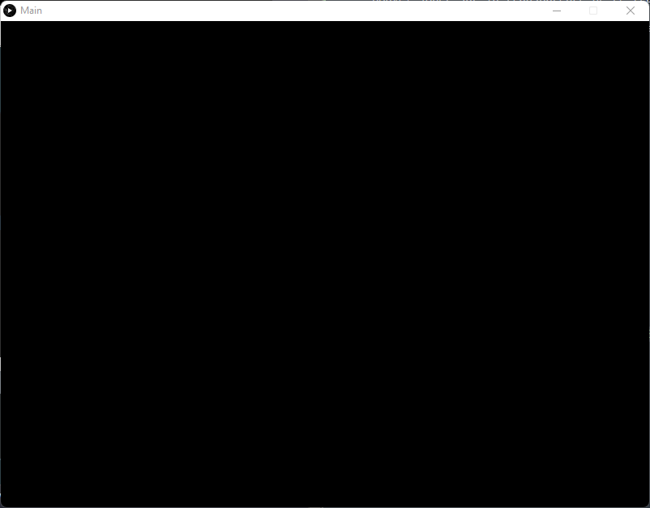
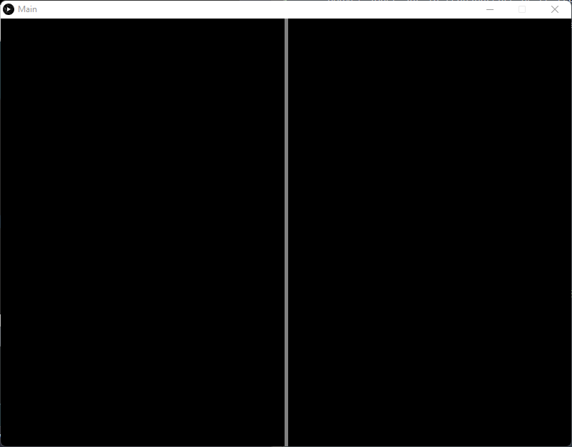
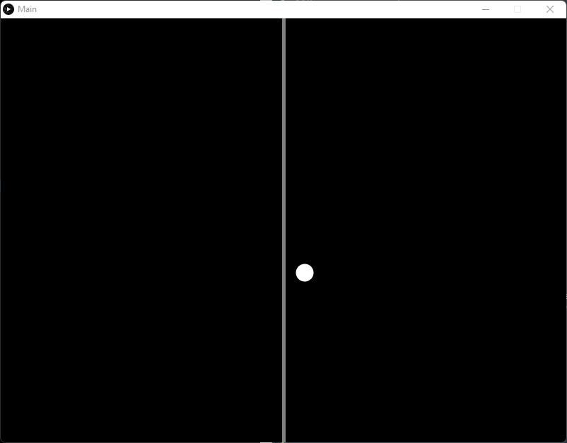
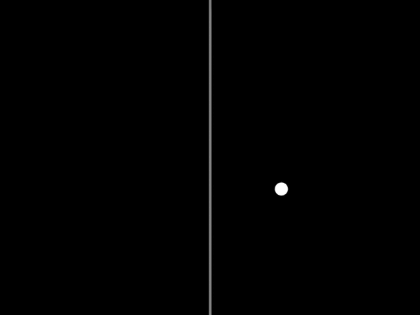
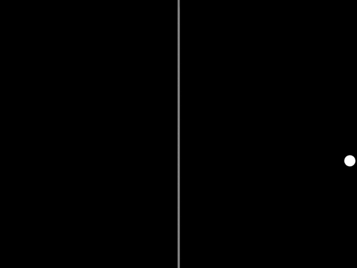
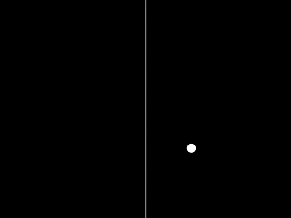

# Processing : Projet Pong

## Introduction

Après avoir appris les bases de la programmation avec Processing, nous allons maintenant créer notre premier jeu vidéo intitulé "Pong".

Pong est un des premiers jeux vidéo d'arcade et le premier jeu vidéo d'arcade de sport. Le jeu est inspiré du tennis de table en vue de dessus, chaque joueur s'affronte en déplaçant la raquette virtuelle de haut en bas de façon à garder la balle dans le terrain de jeu.

## Prérequis

Il faut absolument avoir une base sur la logique algorithmique, sur le langage de programation Processing. Pour cela vous pouvez suivre mon cours "Introduction to Processing" disponible [ici](https://github.com/greg-ynx/Formation-Processing). 

## Analyse de l'inspiration

Le but étant de reprendre et recodé un jeu connu des années 70, nous allons nous basé sur une simple capture d'écran afin de construire notre cahier des charges.


Cette scène est composée :

- D'un tableau des scores
- D'une ligne de délimitation au milieu du "terrain"
- D'une balle
- De deux barres (correspondant aux joueurs)
- D'une palette de couleur binaire (Noir ou blanc)

## Cahier des charges

Créeons un cahier des charges dans lequel nous allons rescenser nos besoins :

1. Une scène de 800px par 600px avec un fond d'écran noir
2. Une ligne verticale blanche au milieu de la scène
3. Une balle blanche rebondissante
4. Deux barres blanches pouvant se déplacer verticalement sur la scène
5. Un tableau des scores affichant les points de chacun des joueurs
6. Le mécanisme de gameplay de "Pong" ajoutant un point au joueur ayant réussi à marquer

## Construction de la scène

Créer un sketch principal nommé `Main`, définissez la taille de la fenêtre de dessin et la couleur du fond de cette fenêtre en noir pur.

Rappel : La couleur du noire pure correspond au `(0, 0, 0)` en `RGB` ou le `#000000` en `hexadecimal`.

<details>
	<summary>Solution</summary>
	<pre>
		<code>
			color bgColor = #000000;
		</code>
		<code>
			void setup() {
			  size(800, 600);
			  background(bgColor);
			}
		</code>
	</pre>
	<p>Résultat :</p> 
	
</details>
<span>  </span>

## Milieu du terrain

Ajoutez un trait blanc vertical à `Main` qui devra passer par le milieu de la scène. Vous pouvez jouer sur la transparence de ce trait afin qu'il ne gène pas lors d'une partie.

Rappel : La couleur du blanche pure correspond au `(255, 255, 255)` en `RGB` ou le `#FFFFFF` en `hexadecimal`. La transparence se modifie avec le quatrième paramètres de couleur nommé `alpha`.

<details>
	<summary>Solution</summary>
	<pre>
		<code>
			color bgColor = #000000;
			color objColor = #FFFFFF;
		</code>
		<code>
			void setup() {
			  size(800, 600);
			  background(bgColor);
			  stroke(objColor, 128);
			  strokeWeight(5); // Modifie la largeur des traits
			  line(400, 0, 400, 600);
			}
		</code>
	</pre>
	<p>Résultat :</p> 
	
</details>

## Balle rebondissante

Nous allons avoir recourt à la POO pour la création de cette balle rebondissante. Soyez sûr de maîtriser le sujet en ayant le [cours](https://github.com/greg-ynx/Formation-Processing) avec vous.

### Construction de la balle

Créez un nouvel onglet que vous nommerez `BouncingBall`, puis créez la classe `BouncingBall`.

La classe `BouncingBall` prendra comme arguments deux variables de position `x`, `y`, la taille de la balle `size`, et comme attribut supplémentaire, sa couleur `ballColor`.

En plus du constructeur, `BouncingBall` sera composé d'une méthode `display()` comme dans le cours.

<details>
	<summary>Solution</summary>
	Classe BouncingBall :
	<pre>
		<code>
			class BouncingBall {
		</code>
		<code>
				int x, y, size;
				color ballColor;
		</code>
		<code>
				BouncingBall(int tempX, int tempY, int tempSize) {
					x = tempX;
					y = tempY;
					size = tempSize;
					ballColor = #FFFFFF;
				}
		</code>
		<code>
				void display() {
					pushMatrix();
					noStroke();
					fill(ballColor);
					circle(x, y, size);
					popMatrix();
				}
			}
		</code>
	</pre>
	Main :
	<pre>
		<code>
			color bgColor = #000000;
			color objColor = #FFFFFF;
			BouncingBall bb;
		</code>
		<code>
			void setup() {
			  size(800, 600);
			  background(bgColor);
			  stroke(objColor, 128);
			  strokeWeight(5); // Modifie la largeur des traits
			  line(width/2, 0, width/2, height);
			  bb = new BouncingBall(430, 360, 25);
			}
		</code>
		<code>
			void draw() {
			  background(bgColor);
			  stroke(objColor, 128);
			  strokeWeight(5);
			  line(400, 0, 400, 600);
			  bb.display();
			}
		</code>
	</pre>
	<p>Résultat :</p> 
	
</details>

### Mouvements de la balle

La balle apparait dans la scène grâce à la méthode `display()`, il faut maintenant lui attribuer des mouvements.

#### Translation sur l'axe x

Pour ce faire, créez une méthode `moveBall()` qui influencera un mouvement de translation de la ball sur l'axe `x` (Horizontal) en prenant un nouvel attrbut de vitesse nommé `speed`. La balle se déplacera avec un pas correspondant à la valeur de `speed`.

Contrainte : `speed` = 2

<details>
	<summary>Solution</summary>
	Classe BouncingBall :
	<pre>
		<code>
			class BouncingBall {
  		</code>
		<code>
		  int x, y, size, speed;
		  color ballColor;
	  	</code>
		<code>
		  BouncingBall(int tempX, int tempY, int tempSize) {
		    x = tempX;
		    y = tempY;
		    size = tempSize;
		    ballColor = #FFFFFF;
		    speed = 2;
		  }
	  	</code>
		<code>
		  void moveBall() {
		    x += speed;
		  }
	  	</code>
		<code>
		  void display() {
		    pushMatrix();
		    noStroke();
		    fill(ballColor);
		    circle(x, y, size);
		    popMatrix();
		  }  
		}
		</code>
	</pre>
	<p>Résultat :</p> 
	
</details>

#### Limites

Problème : La balle sort de la scène ! Nous devons établir des `conditions` afin de limiter l'espace de mouvement de la balle. Si la balle arrive à une des limites, alors, la translation devra se faire dans le sens inverse !

Créez la méthode `bounce()` qui vérifiera si la balle atteint une des limites et change d'orientation une fois cette limite atteinte.

<details>
	<summary>Solution</summary>
	Classe BouncingBall :
	<pre>
		<code>
			class BouncingBall {
		</code>
		<code>
				int x, y, size, speed;
				color ballColor;
		</code>
		<code>
				BouncingBall(int tempX, int tempY, int tempSize) {
					x = tempX;
					y = tempY;
					size = tempSize;
					ballColor = #FFFFFF;
					speed = 2;
				}
		</code>
		<code>
				void moveBall() {
				    x += speed;
			  	}
	  	</code>
		<code>
			  	void bounce() {
				    if (x < 0) {
				      speed = -speed;
				    }
				    else if (x > width) {
				      speed = -speed;
				    }
			  	}
	  	</code>
		<code>
				void display() {
					pushMatrix();
					noStroke();
					fill(ballColor);
					circle(x, y, size);
					popMatrix();
				}
			}
		</code>
	</pre>
	Main :
	<pre>
		<code>
			color bgColor = #000000;
			color objColor = #FFFFFF;
			BouncingBall bb;
		</code>
		<code>
			void setup() {
				size(800, 600);
				background(bgColor);
				stroke(objColor, 128);
				strokeWeight(5);
				line(width/2, 0, width/2, height);
				bb = new BouncingBall(430, 360, 25);
			}
		</code>
		<code>
			void draw() {
				background(bgColor);
				stroke(objColor, 128);
				strokeWeight(5);
				line(400, 0, 400, 600);
				bb.moveBall();
				bb.bounce();
				bb.display();
			}
		</code>
	</pre>
	<p>Résultat :</p> 
	
</details>

La logique de mouvements sur l'axe x est respectée, néanmoins, la balle passe quand même la bordure de moitié...

Pour résoudre ce problème, il faut prendre en compte la moitié de la balle comme suivant :

```java
 void bounce() {
    if (x - size / 2 < 0) {
      speed = -speed;
    }
    else if (x + size / 2 > width) {
      speed = -speed;
    }
  }
```

Résultat :


Maintenant la balle rebondit de façon logique dans l'espace comme voulu... uniquement sur l'axe x !

#### Translation sur l'axe y

Il faut maintenant attribuer un mouvement à la balle sur l'axe y (Vertical). On reprend la même logique qu'avec la translation sur l'axe x mais à une vitesse différente. 

Séparez la variable `speed` en varaibles `speedX` et `speedY` et appliquez tous les besoins et contraintes que nous avions appliqué précédement. 

- `speedX` = 2
- `speedY` = 1

<details>
	<summary>Solution</summary>
	Classe BouncingBall :
	<pre>
		<code>
			class BouncingBall {
		</code>
		<code>
				int x, y, size, speedX, speedY;
				color ballColor;
		</code>
		<code>
				BouncingBall(int tempX, int tempY, int tempSize) {
					x = tempX;
					y = tempY;
					size = tempSize;
					ballColor = #FFFFFF;
					speedX = 2;
    				speedY = 1;
				}
		</code>
		<code>
				void moveBall() {
				    x += speedX;
    				y += speedY;
			  	}
	  	</code>
		<code>
			  	void bounce() {
				    if (x - size / 2 < 0) {
				      speedX = -speedX;
				    }
				    else if (x + size / 2 > width) {
				      speedX = -speedX;
				    }
	    </code>
		<code>
				    if (y - size / 2 < 0) {
				      speedY = -speedY;
				    }
				    else if (y + size / 2 > height) {
				      speedY = -speedY;
				    }
			  	}
	  	</code>
		<code>
				void display() {
					pushMatrix();
					noStroke();
					fill(ballColor);
					circle(x, y, size);
					popMatrix();
				}
			}
		</code>
	</pre>
	Main :
	<pre>
		<code>
			color bgColor = #000000;
			color objColor = #FFFFFF;
			BouncingBall bb;
		</code>
		<code>
			void setup() {
				size(800, 600);
				background(bgColor);
				stroke(objColor, 128);
				strokeWeight(5);
				line(width/2, 0, width/2, height);
				bb = new BouncingBall(430, 360, 25);
			}
		</code>
		<code>
			void draw() {
				background(bgColor);
				stroke(objColor, 128);
				strokeWeight(5);
				line(400, 0, 400, 600);
				bb.moveBall();
				bb.bounce();
				bb.display();
			}
		</code>
	</pre>
	<p>Résultat :</p> 
	
</details>

Nous avons fini de créer la balle et programmer son comportement, passons aux joueurs !

## Barres (joueurs)

Ouvrez un nouvel onglet nommé `Bar` dans lequel nous allons créer une classe du même nom.

Cette classe devra prendre en argument sa position en `x`, sa position en `y`, sa largeur `w` et sa hauteur `h`. Parmis ses attributs devra se trouver sa couleur `barColor` (blanche) et sa vitesse `speed` = 5. Les méthodes attendues de la classe sont `display()` et `moveBar()`.

Créez la classe `Bar`.

