# Formation : Introduction à Processing

## Introduction
La programmation est un vaste domaine de l'informatique permettant le développement d'applications et de services exécutables par ordinateur. Apprendre un langage de programmation est à la portée de tous. Néanmoins, cet apprentissage nécessite une logique et une capacité d'analyse accrue afin de pouvoir écrire les algorithmes structurant vos créations. Dans ce cours, vous allez apprendre les bases de la programmation en utilisant Processing dans le but de créer quelques mini-jeux tel que "Pong".

## Processing
Processing est un carnet de croquis logiciel flexible et un langage de programmation (PL) pour apprendre à coder dans le contexte des arts visuels. Depuis 2001, Processing fait la promotion de la littératie logicielle dans les arts visuels et de la littératie visuelle dans la technologie. Il y a des dizaines de milliers d’étudiants, d’artistes, de concepteurs, de chercheurs et d’amateurs qui utilisent le traitement pour l’apprentissage et le prototypage.

Processing peut donc être utilisé dans tout domaines des arts visuelles tels que celui des jeux vidéo jusqu'au traitement d'images, par exemple, la dectection de mouvement.

### Installation

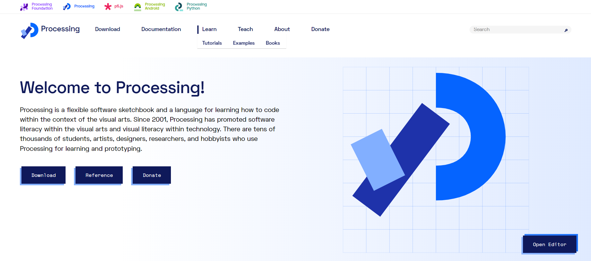

Rendez-vous sur [le site officiel de Processing](https://processing.org), descendez vers la section "Getting started", dans la catégorie "Get the software" vous retrouvez un bouton "Download Processing". Cliquer sur le bouton, vous serez redirigé vers la page de téléchargement, vous avez plus qu'a choisir la version du logiciel Processing (peut importe laquelle) qui correspond à votre système d'opération (OS) c'est-à-dire Windows, MacOS ou Linux.


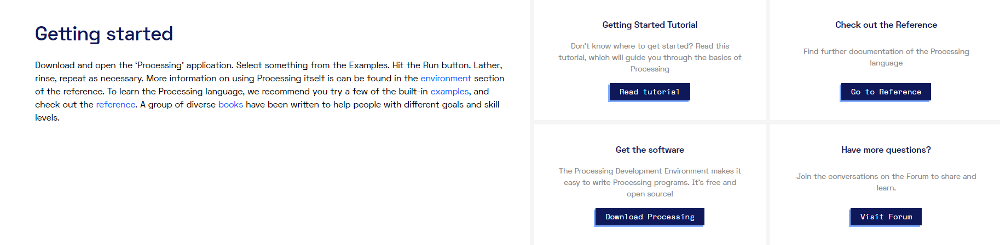

Section "Getting started"


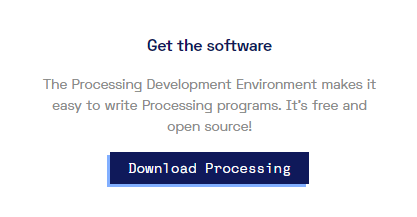

Catégorie "Get the software" avec le bouton "Download Processing"


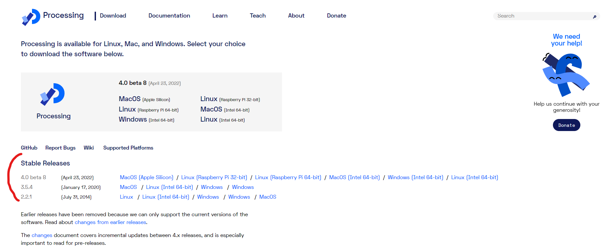
Page de téléchargement


Suite au téléchargement, vous obtiendrez un document .zip qu'il faudra décompresser dans le dossier de votre choix : 


Vous pouvez maintenant acceder à l'application Processing:

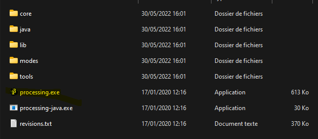


### Présentation de l'IDE Processing

Un Environnement de Développement Intégré (IDE) est le logiciel qui vous premettra de "coder" des applications, en effet, ces logiciels vous permettent d'écrire dans les différents langages de programmation (que nous appelerons PL pour "Programming Language") supportés.

L'IDE Processing supporte de base les langages Java et Python. Ici, nous utiliserons Java pour le reste du cours.

Voici la page d'acceuil : 


Les fichiers/programmes sont appelés "sketch" contenant le code écrit pour votre programme.


1. Menu
2. Bouton "Run" : Execute le sketch
3. Bouton "Stop" : Arrête l'exécution du sketch
4. Bouton debugage
5. Menu défilant des options (choix des PL)
6. Barre d'onglets
7. Sketch
8. Console et console d'erreurs


### Hello world

Nous allons écrire notre premier programme ! Ce dernier devra renvoyer la phrase "Hello World!" dans la console : 

Pour cela, il existe une fonction (Nous définirons ce terme plus tard) qui affiche du contenu dans la console. Nous parlons de la fonction ```println()```.

Ecrivez la ligne suivante dans le sketch :

```java
println("Hello World!");
```


## Structure d'un sketch Processing

On retrouve dans un sketch deux fonctions fondamentales nommées ```setup()``` et ```draw()``` que nous allons étudier:

### setup()

```setup()``` est une fonction qui s'exécute qu'une seule fois lors du début du programme. Elle est codée de la manière suivante :

```java
void setup() {
	// Instructions
}
```

Le mot-clé "void" est le type de l'élément de retour de cette fonction, ici, la fonction setup() ne renvoie rien, c'est pourquoi sont type de retour est dit "vide".

### draw()

```draw()``` est une fonction qui s'exécute en boucle en lisant les instructions de haut en bas tant que l'exécution du sketch n'est pas arrêté.
Elle est codée de la manière suivante :

```java
void draw() {
	// Instructions
}
```

La fonction ```draw()``` est de type "void" comme la fonction ```setup()```.

Voyons ce que ça donne à l'exécution :


## Variables

Les variables sont des espaces de la mémoire réservés afin d'y attribuer une valeur. Les variables sont composées de trois éléments : 

- Un type
- Un nom
- Une valeur

La création d'une variable est nommé "déclaration de variable", déclarons différentes variables : 

```java
int a = 4;
int b = 5;
```

Nous avons déclaré deux variables, la variable "a" et la variable "b". Si l'on décompose ces variable en les trois éléments dont nous parlions ci-dessus alors :

- Quel est le type, le nom et la valeur de la variable "a" ?
<details>
	<summary>Réponse</summary>
	Type : int, Nom : a, Valeur : 4
</details>

- Même question pour la variable "b" ?
<details>
	<summary>Réponse</summary>
	Type : int, Nom : b, Valeur : 5
</details>

ATTENTION : Comme vous avez pu le voir, chaque déclaration est succédé d'un point virgule, celà est dû à la synthax de Java qui veut que chacune des instructions de code se finisse par un point virgule.

On en conclut donc qu'une déclaration de variable est une instruction de code.

### Exercice 1

Créer un sketch où vous allez déclarer trois variables de type ```int``` nommées a, b et c avec :

- a = 6
- b = 7
- c = 100

Afficher ensuite une seul fois les variables b et c dans la console puis la variable a en dernière.

<details>
	<summary>Réponse</summary>
	<pre>
		<code>
		  int a = 6;
		  int b = 7;
		  int c = 100;		  
		  println(b);
		  println(c);
		  println(a);
		</code>
	</pre>

	7

	100

	6

</details>


## Types

On appelle "type de donnée" ou plus simplement "type" la nature des valeurs que peut prendre une donnée.

Processing appelle "Data" les types dits `primitifs`, les types dits `composites` ainsi que les fonctions qui leurs correspondent. Ici nous allons nous attarder uniquement sur les types contenus dans le terme "Data".

### Primitive

On appelle `Primitive` les types de données suivantes :

- *boolean* : Les valeurs booléenne `true` et `false`
- *byte* : Les valeurs numériques contenues dans 8 bits (octet) en binaire signé -> de 127 à -128
- *char* : Les valeurs représentant un caractère tel que des lettres ou des symboles (A, b, €)
- *color* : Les valeurs représentant des couleurs, en RGB, en ARGB et en hexadecimal
- *double* : Les valeurs à virgule contenues dans l'intervalle de 64 bits
- *float* : Les valeurs à virgule contenues dans l'intervalle de 32 bits
- *int* : Les valeurs entières contenues dans l'intervalle de 32 bits
- *long* : les valeurs entières contenues dans l'intervalle de 64 bits

### Composite

On appelle `Composite` les types de données suivantes : 

- *Array* : Liste de données
- *ArrayList* : Liste d'objets 
- *FloatDict* : Dictionnaire contenant des float
- *FloatList* : Liste contenant uniquement des float
- *HashMap* : Hashmap contenant une collection d'objects
- *IntDict* : Dictionnaire contenant des int
- *IntList* : Liste contenant uniquement des int
- *JSONArray* : Tableau respectant la synthax JavaScript Object Notation
- *JSONObject* : Object respectant la synthax JavaScript Object Notation
- *Object* : Instance de classes
- *String* : Chaine de caractères
- *StringDict* : Dictionnaire contenant des String
- *StringList* : Liste contenant uniquement de String
- *Table* : Classe permettant de manipuler des fichier tableurs (.csv, .tsv)
- *TableRow* : Objet représentant une ligne d'une instance de `Table`
- *XML* : Classe représentant le noeud d'un arbre `XML`

### À retenir

Les principaux types à retenir sont :

- `int`
- `float`
- `boolean`
- `color`
- `String`
- `Array`

D'autre types sont interressants, tels que les `JSONArray`, les `JSONObject` et les `Object`, mais nous en parlerons plus tard dans la formation.

Voici un exemple de déclaration de variables avec les types précédents : 

```java
int a = 1; // 1
float b = .5; // 0,5
boolean bool = true; // Valeur booléenne "vraie"
color c = #FFFFFF; // Code hexadecimal de la couleur blanche
String text = "Bonjour!"; // Chaîne de caractères
int[] num = new int[3]; // Array de 3 nombres entiers
```

### Exercice 2

#### Question 2.1

Quel est le type associé à la valeur `false` ?
<details>
	<summary>Réponse</summary>
	R : <code>boolean</code>.
</details>

#### Question 2.2

Déclarons trois variables : 
```java
char a = 'A'; // (1)
char[] b = new char[5]; // (2)
String c = "Bonjour!"; // (3)
```

Quel est la différence entre la déclaration d'un caractère (1) et d'une chaine de caractères (2) ?
<details>
	<summary>Réponse</summary>
	R : L'utilisation des "simple quotes (')" et des "double quotes (")" différencie en Java le type d'une donnée. On utilise l'apostrophe pour un <code>char</code> et les guillomets pour les <code>String</code>.
</details>

#### Question 2.3

Dans le même contexte, quel est le type de cette variable (2) ? Que veut dire `new char[5]` ?
<details>
	<summary>Réponse</summary>
	<p>R1 : C'est un <code>Array</code> contenant des <code>char</code>.</p>
	<p>R2 : C'est la création d'une <code>nouvelle liste</code> spécifiant son contenu exclusif en <code>char</code> et sa <code>taille de 5 emplacements</code>.
	Exemple : </p>
</details>

#### Question 2.4

Quel est le code hexadecimal de la couleur noire ?
<details>
	<summary>Réponse</summary>
	R : <code>#000000</code>
</details>


## Opérateurs

Les opérateurs sont des fonctions sous forme de symboles qui permettent des calculs et de relations entre valeurs.

### Opérateurs mathématiques

#### Opérateurs mathématiques principaux

| Opérateur | Symbole | Description                      | Exemples                |
|:----------|:-------:|:---------------------------------|:------------------------|
| Addition  | `+`       | Calcul la somme                | `5+5` -> 10  		   |
| Minus     | `-`       | Calcul la différence           | `5-5` -> 0   		   |
| Multiply  | `*`       | Calcul le produit              | `5*5` -> 25  		   |
| Divide    | `/`       | Calcul le quotient             | `5/5` -> 1   		   |
| Modulo    | `%`       | Calcul le reste d'une division | `5%5` -> 0 ; `6%5` -> 1 |


#### Opérateurs mathématiques combinés

| Opérateur        | Symboles | Description                             | Exemples                 |
|:-----------------|:--------:|:----------------------------------------|:-------------------------|
| Add assign       | `+=`     | Combine l'addition à l'assignement      | `a += 5` <=> `a = a + 5` |
| Substract assign | `-=`     | Combine la soustraction à l'assignement | `a -=5` <=> `a = a - 5`  |
| Multiply assign  | `*=`     | Combine le produit à l'assignement      | `a *= 5` <=> `a = a * 5` |
| Divide assign    | `/=`     | Combine le quotient à l'assignement     | `a /= 5` <=> `a = a / 5` |
| Increment        | `++`     | Augmente la valeur d'un entier          | `a++` <=> `a = a + 1`    |
| Decrement        | `--`     | Réduit la valeur d'un entier            | `a--` <=> `a = a - 1`    |


### Opérateurs au niveau du bit

| Opérateur   | Symbole | Description                                          | Exemple             |
|:------------|:-------:|:-----------------------------------------------------|:--------------------|
| Bitwise AND | `&`     | Compare chaque bit correspondant avec l'opérateur ET | `110 & 011` -> 010  |
| Bitwise OR  | `\|`    | Compare chaque bit correspondant avec l'opérateur OU | `110 \| 011` -> 101 |
| Left shift  | `<<`    | Déplace la séquence de bits à gauche                 | `13 << 1` -> 26     |
| Right shift | `>>`    | Déplace la séquence de bits à droite                 | `16 >> 3` -> 2      |

### Opérateurs relationnels

| Opérateur                | Symbole | Description                                                              | Exemples                                  |
|:-------------------------|:-------:|:-------------------------------------------------------------------------|:------------------------------------------|
| Less than                | `<`     | Teste si la valeur de gauche est inférieur à la valeur de droite         | `3 < 5` -> `true`; `3 < 1` -> `false`     |
| Greater than             | `>`     | Teste si la valeur de gauche est supérieur à la valeur de droite         | `5 > 3` -> `true` ; `5 > 6` -> `false`    |
| Equality                 | `==`    | Détermine si deux valeurs sont equivalentes                              | `1 == 1` -> `true` ; `1 == 2` -> `false`  |
| Inequality               | `!=`    | Détermine si deux valeurs ne sont pas équivalentes                       | `1 != 1` -> `false` ; `1 != 2` -> `true`  |
| Less than or equal to    | `<=`    | Teste si la valeur de gauche est inférieur ou égal à la valeur de droite | `3 <= 5` -> `true` ; `3 <= 3` -> `true`   |
| Greater than or equal to | `>=`    | Teste si la valeur de gauche est supérieur ou égal à la valeur de droite | `5 >= 3` -> `true` ; `5 >= 5` -> `true`   |

### Opérateurs logiques

| Opérateur   | Symbole | Description                                                                                      | Exemple             |
|:------------|:-------:|:-------------------------------------------------------------------------------------------------|:--------------------|
| Logical AND | `&&`    | Compare deux expressions et retourne `true` si et uniquement si les deux expressions sont `true` |                     |
| Logical OR  | `\|\|`  | Compare deux expressions et retourne `true` si une des expressions est `true`                    |                     |
| Logical NOT | `!`     | Inverse la valeur booléenne d'une expression                                                     | `!true` -> `false`  | 

### Exercice 3

#### Question 3.1

Créer deux variables "a" et "b" tel que :
- a = 3
- b = 8

Afficher la valeur de a et b ainsi que la variable "c" représentant l'addition de ces deux variables.

<details>
	<summary>Réponse</summary>
	R :
	<pre>
		<code>
			int a = 3;
			int b = 8;
			int c = a + b;
			println(a);
			println(b);
			println(c);
		</code>
	</pre>
	Résultat :
	<pre>
		<code>		
			3
			8
			11
		</code>
	</pre>
</details> 

#### Question 3.2

Créer un sketch dans lequel vous déclarerez une variable nulle nommée "a" qui augmentera d'une unité jusqu'à que le sketch soit arrêté.

<details>
	<summary>Réponse</summary>
	R :
	<pre>
		<code>
			int a = 0;
			void draw() {
				a++;
				println(a);
			}
		</code>
	</pre>
</details>

#### Question 3.3

Créer un sketch dans lequel vous déclarerez une variable nulle "a" qui augmentera d'une unité jusqu'à que le sketch soit arrêté. Créer une autre variable "x" ayant pour valeur 100 et afficher la valeur de la comparaison entre a et x si elles sont égales.

Pour procéder à cette `condition`, nous allons utiliser une instruction nommée `if` :

```java
if (expression) {
	println(expression);
}
```

<details>
	<summary>Réponse</summary>
	R :
	<pre>
		<code>
			int a = 0;
			int x = 100;
			void draw() {
				a++
				if (x == a) {
					println(x == a);
				}
			}
		</code>
	</pre>
	Résultat
	<pre>
		<code>
			true
		</code>
	</pre>
</details>

## Commentaires

Les commentaires sont des séquences de textes qui destinés à l'humain et ignorés par le programme. Pour cela on utilise différents symboles listés dans ce tableau

| Nom                          | Symbole  | Description                       |
|:-----------------------------|:--------:|:----------------------------------|
| Commentaire                  | `//`     | Commentaire sur une ligne         |
| Commentaire multi-ligne      | `/* */`  | Commentaire sur  plusieurs lignes |
| Commentaire de documentation | `/** */` | Documentation                     |

Exemples : 

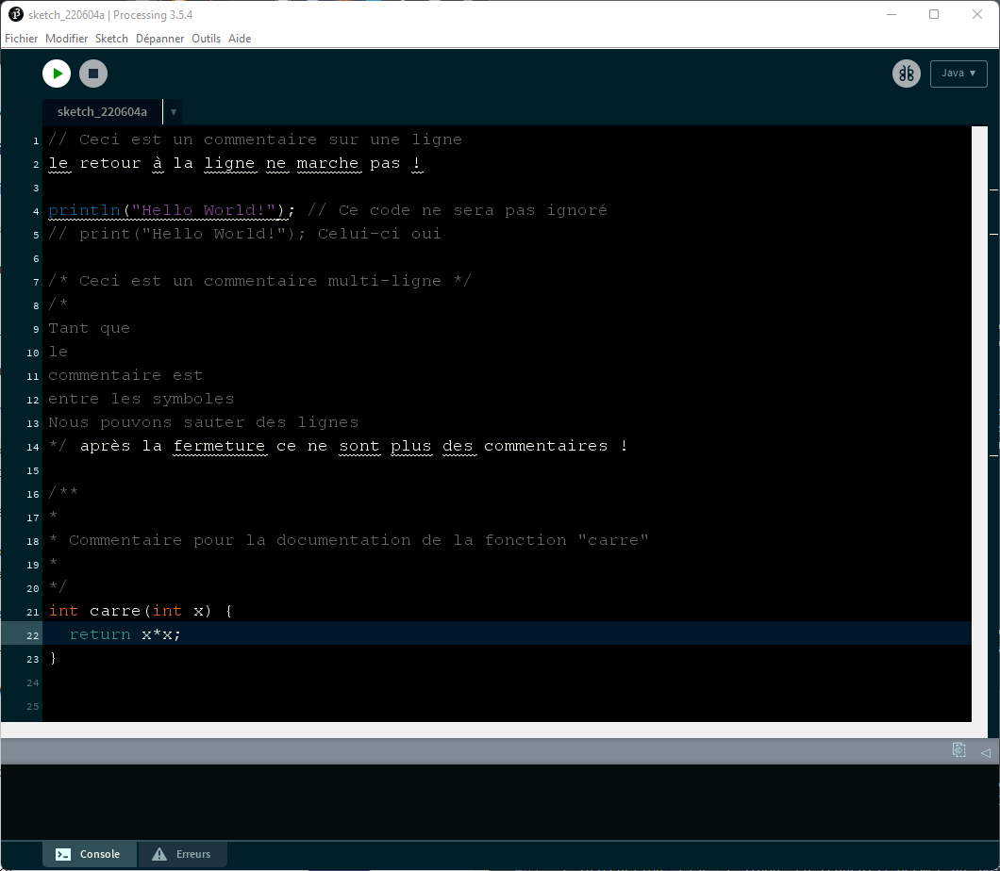


## Instructions conditionnelles

### if

L'instruction `if` ("si" en français) permet au sketch de prendre une décision sur quel code exécuter en fonction du ou des exrpessions contenues dedans.

```java
if (expression) {
	// Instructions
}
```

Par exemple, si on reprend la question 3.3, le code affichant l'expression `x == a` est exécuté uniquement si la valeur de `x` est égale à la valeur attribuée à `a`.

### else

L'instruction `else` ("sinon" en français) permet au sketch de prendre une décision sur quel code à exécuter si la condition de l'instruction `if` associée retourne `false`.

L'instruction `else` ne peut donc pas exister sans l'existance d'une instruction `if` en amont.

```java
if (expression) {
	// Instructions
}
else {
	// Instructions
}
```

`else` n'utilise pas d'expression comme vous pouvez le voir sur la structure ci-dessus.

Par exemple, dans la question 3.3, nous pouvons afficher la valeur de l'expression peu importe le résultat de ce dernier : 

```java
int a = 0;
int x = 100;
void draw() {
	a++
	if (x == a) {
		println(x == a);
	}
	else {
		println(x == a);
	}
}
```

Le problème avec cet algorithme c'est qu'il est inutile, en effet, on pourrait écrire un algorithme plus simple :

```java
int a = 0;
int x = 100;
void draw() {
	a++
	println(x == a);
}
```

Ça tombe bien ! Nous allons modifier le problème de la question pour tirer profit de l'instruction `else`.

Déclarez les  variables `a` et `x` comme dans la question 3.3, et incrémentez la valeur de `a` indéfiniment. SI la valeur de `a` est égale à la valeur de `x` alors afficher dans la console le message suivant :  Les deux variables sont égales. SINON afficher le message suivant : La variable 'a' n'est pas égale à x.

<details>
	<summary>Réponse</summary>
	R :
	<pre>
		<code>
			int a = 0;
			int x = 100;
			void draw() {
				a++
				if (x == a) {
					println("Les deux variables sont égales");
				}
				else {
					println("La variable 'a' n'est pas égale à x");
				}
			}
		</code>
	</pre>
</details>

### else if

L'instruction `else if` ("sinon si" en français) permet au sketch de prendre une décision liée à une autre expression tout en prenant compte de la condition `if` associée.

L'instruction `else if` peut donc être vu comme un deuxième `if` mais qui respecte les différentes conditions associées au plus proche `if` en amont.

```java
if (expression1) {
	// Instructions
}
else if (expression2) {
	// Instructions
}
```

L'utilisation du `else if` ne necessite pas l'utilisation du `else` comme vous pouvez le voir ci-dessus.

Reprennez le dernier algorithme et ajouter la condition si la variable `a` est supérieure à 3, afficher : a est supérieure à 3.

<details>
	<summary>Réponse</summary>
	R :
	<pre>
		<code>
			int a = 0;
			int x = 100;
			void draw() {
				a++
				if (x == a) {
					println("Les deux variables sont égales");
				}
				else if (a > 3) {
					println("a est supérieure à 3");
				}
				else {
					println("La variable 'a' n'est pas égale à x");
				}
			}
		</code>
	</pre>
</details>

Comme vous pouvez le voir, l'instruction `else` a été ignorée. C'est à cause du fait que la condition `else if` est vraie, le code exécuter est donc celui de la condition validée.

Pour pouvoir afficher les deux coditions valides, on utilise une autre instruction `if` comme suivant : 

```java
int a = 0;
int x = 100;
void draw() {
	a++;
	if (x == a) {
		println("Les deux variables sont égales");
	}
	else {
		println("La variable 'a' n'est pas égale à x");
	}
	if (a > 3) {
		println("a est supérieure à 3");
	}
}
```

Affichage sur la console : 

```
La variable 'a' n'est pas égale à x
...
a est supérieure à 3
La variable 'a' n'est pas égale à x
...
Les deux variables sont égales
a est supérieure à 3
...
```

ATTENTION : Les conditions qui sont vraies en même temps et qui doivent être exécutées en même temps sont celles qui doivent être séparée par une instruction `if`. Comme dans l'exemple ci-dessus, c'est l'ancien `else if` qui s'est transformé en `if`.

### ?:

L'instruction ou synthax `?:` est une abréviation du `if` et du `else` et se code comme suit :

```java
resultat = condition ? expression1 : expression2;
```

Il faudra utiliser une variable pour stocker la valeur de retour de l'opérateur `?:`, la condition est testée, si elle est `true`, alors `expression1` sera la valeur de `resultat`, sinon `expression2` sera la valeur de `resultat`.

La synthax précédente correspond à cet algorithme : 

```java
if (condition) {
	resultat = expression1;
}
else {
	resultat = expression2;
}
```

### switch

`switch` est une instruction fonctionnant comme `if` et `else`, néanmoins, cette instruction est plus adaptée lorsque vous êtes confrontés à trois conditions ou plus.

Elle s'écrit de la sorte :

```java
// val est une variable numérique
switch(val) {
	case 0:
		// Instruction
		break;
	case 1:
		// Instruction
		break; 
}
```

Traduction : Le `switch` prend en donnée d'entrée une variable dont il va lire la valeur et prendre une décision grâce à l'instruction `case` qui représente le "cas" de la variable d'entrée (ici, `val` peut être égale à 0 ou 1).

L'instruction `break` consiste à quitter le block `switch`, en effet, une fois que la décision est prise et que le code choisi est exécuter, il est inutile de continuer à tourner dans le block.

Il existe aussi une instruction nommé `default` qui va proposer un cas de valeur par défaut si aucun des `case` est validé.

Exemple :

```java
int val = 4;
switch(val) {
	case 0:
		println("Zéro");
		break;
	case 1:
		println("Un");
		break;
	default:
		println("Quatre");
		break;
}
```

Affichage sur la console : 

```
Quatre
```

### break

Comme cité précédement, `break` est une instruction qui sert à sortir d'un block de code tel que le `switch` et les boucles `while` et `for` (Nous verrons les bloucles plus tard).

### continue

L'instruction `continue` sert à ignorer le reste de code à exécuter dans un block de code (plus précisément les boucles).

Exemple :

```java
for (condition1) {
	if (condition2) {
		continue;
	}
	// Instructions
}
```

Dans cet exemple, nous avons recours à une boucle `for` qui va itérer autant de fois que `condition1` le permet. On a ajouter une instruction conditionnelle `if` afin de prendre une décision à un moment dans le block de code. Si la condition est validée, alors, les instructions seront ignorées et le sketch passera à l'itération suivante. Sinon (`condition2` == `false`) les instructions seront exécutées.

### Exercice 4

#### Question 4.1

Créer un sketch qui sera capable de prendre un entier non nul "x" et qui affichera si ce nombre est pair ou nous dans la console.

Tester avec `x = 1` et `x = 2`

<details>
	<summary>Réponse</summary>
	R :
	<pre>
		<code>
			int x = 1;
			if (x % 2 == 0) {
				println("C'est un nombre pair");
			}
			else {
				println("C'est un nombre impair");
			}
		</code>
	</pre>
</details>

#### Question 4.2

Reprennons le même problème, la variable "x" peut être un entier quelconque (même nul), cette fois-ci, le sketch devra afficher si le nombre est nul, pair ou impair. CONTRAINTE, vous devez utilser l'instruction `switch` dans le code (On vous aide, le `switch` devra verifier l'expression `x % 2`).

Tester avec `x = 0`, `x = 1` et `x = 2`

<details>
	<summary>Réponse</summary>
	R :
	<pre>
		<code>
			int x = 0;
			switch(x % 2) {
			  case 0:
			    if (x != 0) {
			      println("C'est un nombre pair");
			    }
			    else {
			      println("C'est un nombre nul");
			    }
			    break;
			  default:
			    println("C'est un nombre impair");
			    break;
			}
		</code>
	</pre>
</details>

#### Question 4.3

On possède le code suivant :

```java
String[] liste = new String[3];
liste[0] = "Bonjour";
liste[1] = "Bonsoir";
liste[2] = "Salut!";
for (int i=0; i<=2; i++) {
  println("Iteration" + i);
  // Instruction conditionnelle
  println("Prochaine itération" + (i+1)); 
}
```

Trouver l'instruction conditionnelle qui permettra au sketch d'afficher pour quelle valeur de `i` l'élément de la liste est égale à `Bonsoir` et qui ignorera à partir de ce moment le reste de la boucle `for`.

<details>
	<summary>Réponse</summary>
	R :
	<pre>
		<code>
			String[] liste = new String[3];
			liste[0] = "Bonjour";
			liste[1] = "Bonsoir";
			liste[2] = "Salut!";
			for (int i=0; i<=2; i++) {
			  println("Iteration" + i);
			  if (liste[i] == "Bonsoir") {
			    println(liste[i]);
			    break;
			  }
			  println("Prochaine itération" + (i+1)); 
			}
		</code>
	</pre>
</details>

## Boucles

### while

`while` est une boucle d'itération ("Tant que" en français). Elle s'écrit de cette façon :

```java
while (condition) {
	// Instruction
}
```

Tant que la condition est vraie `true` le code à l'intérieur de la boucle `while` sera exécuté.

On peut utiliser le mot-clé `break` pour sortir de cette boucle.

### for

`for` est une boucle d'itération ("Pour" en français). Elle s'écrit de cette façon :

```java
for (iterateur; condition; pas) {
	// Instruction
}
```

La boucle `for` utilise trois paramètres :

- `iterateur` : Une variable à déclarer et initialiser à une valeur itérable.
- `condition` : Une condition quelconque, souvent utilisant l'`iterateur` et un opérateur de comparaison.
- `pas` : Le pas que vous voulez donner à l'`iterateur` à chaque itération de la boucle, généralement on place `iterateur++` afin d'incrémenter un entier à chaque itération.

Exemple :

```java
// Boucle for
for (int i = 0; i < 10; i++) {
	println(i); // Affiche la valeur de i
}
```

Ce sketch va afficher la valeur de l'itérateur `i` à chaque itération. Testez le et vous verrez que les valeurs de 0 à 9 seront affichées.

### Exercice 5

#### Question 5.1

On vous donne la liste d'entier `liste` et deux variables `maxi` et `mini`.

Créer deux sketchs, un utilisant la boucle `for` et l'autre utilisant la boucle `while`, ces sketchs doivent pouvoir lire chaque valeur de `liste` et trouver l'entier le plus petit et le plus grand de la liste d'entiers. Vous devrez ensuite afficher les valeurs de `liste`, `mini` et `maxi`.

```java
int mini = 0;
int maxi = 0;
int[] liste = new int[10];
for (int a = 0; a < 10; a++) {
  liste[a] = int(random(100));
}

// Ecrivez votre réponse ici
```

<details>
	<summary>Réponse for</summary>
	R1 (for) :
	<pre>
		<code>
			int mini = 0;
			int maxi = 0;
			int[] liste = new int[10];
			for (int a = 0; a < 10; a++) {
			  liste[a] = int(random(100));
			}
			for (int i = 0; i < liste.length ; i++) {
			  if (i == 0) {
			    mini = liste[i];
			    maxi = liste[i];
			    continue;
			  }
			  if (maxi < liste[i]) {
			    maxi = liste[i];
			  }
			  if (mini > liste[i]) {
			    mini = liste[i];
			  }
			}
			println(liste);
			println(mini);
			println(maxi);
		</code>
	</pre>
</details>

<details>
	<summary>Réponse while</summary>
	R2 (while) :
	<pre>
		<code>
			int mini = 0;
			int maxi = 0;
			int[] liste = new int[10];
			for (int a = 0; a < 10; a++) {
			  liste[a] = int(random(100));
			}
			int i = 0;
			mini = liste[i];
			maxi = liste[i];
			while (i < liste.length) {
			  if (maxi < liste[i]) {
			          maxi = liste[i];
			  }
			  if (mini > liste[i]) {
			    mini = liste[i];
			  }
			  i++;
			}
			println(liste);
			println(mini);
			println(maxi);
		</code>
	</pre>
</details>


## Fonctions

Les fonctions sont des sous-programmes permettant d'effectuer des opérations répétitives. Au lieu d'écrire un code complet où des instructuions se répètent de manière similaire. Nous pouvons créer une fonction et appeler celle-ci afin d'exécuter la partie de code répétitive. Les fonctions permettent de simplifier l'écriture et la lecture de code, elles permettent aussi de faciliter l'optimisation de notre programme.

Sur Processing, une fonction s'écrit de la sorte :

```java
returnType name(arguments) {
	// Instructions -> sous programme
}
```

- `returnType` correspond au type de retour de la fonction
- `name` est le nom attribuer à la fonction, attention, les mots-clés liés au langage de programmation ne doivent pas être utilisé comme nom de fonction !
- `arguments` ce sont les arguments/paramètres extérieurs à la fonction, une fonction ne requiert pas forcément d'argument. Dans une fonction, les arguments sont forcément contenu entre des parenthèses `()` collées au nom de la fonction.
- `{}` les accollades représentent les blocks ou scope de code dans lesquelles se trouve le "sous-programme".

### Fonctions intégrées

Les fonctions intégrées dans Processing sont des fonctions pré-faites, nous avons déjà vu les fonctions `setup()` et `draw()`. Vous pouvez retrouver les fonctions intégrées à Processing [ici](https://processing.org/reference/).

Nous allons voir quelques autres fonctions utiles dans Processing pour le dessin.

#### size()

Vous avez déjà pu voir une petite fenêtre vide apparaitre à chaque exécution de sketch durant ce cours. C'est la fenêtre de dessin. En effet, Processing est utiliser à des fins d'art visuel.

La fonction `size()` sert à définir la taille de cette fenêtre de dessin.

Rentrez le code suivant :

```java
size(640, 360);
```

Comparaison des résultats : 

- De base :


- Avec `size(640,360)` :

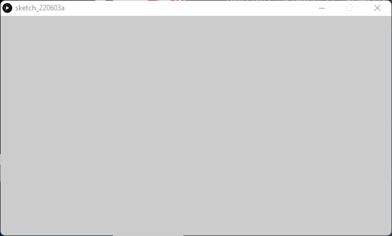

#### line()

La fonction `line()` dessine une ligne dans la fenêtre de dessin, cette ligne représente un segment et s'écrit :

```java
line(x1, y1, x2, y2);
```

Avec `x1` la position en abscisse (horizontal) du premier point, `y1` la position en ordonné (vertical) du premier point.

`x2` la position en abscisse du deuxième point et `y2` la position en ordonné du deuxième point.

Ces quatre arguments sont des `float` mais les `int` sont aussi acceptés.

À la suite du code précédent, ajouter ce code :

```java
line(120, 80, 340, 300);
```

Résultat : 

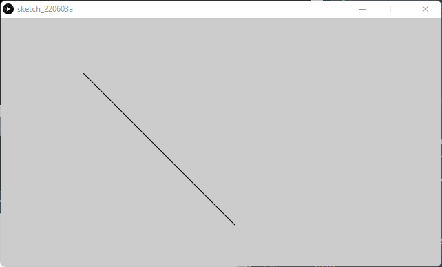

#### Autres fonctions 2D

La fonction `line()` fait partie des `2D Primitives`, dans cette liste de fonction, on compte :

- `point()` : Dessine un point (1 pixel)
- `line()` : Dessine une ligne entre deux points
- `arc()` : Dessine un arc de cercle
- `circle()` : Dessine un cercle
- `ellipse()` : Dessine une ellipse (forme ovale)
- `triangle()` : Dessine un triangle
- `quad()` : Dessine un quadrilatère
- `rect()` : Dessine un rectangle
- `square()` : Dessine un carré

#### Gestion des couleurs

- `background()` : Applique une couleur au fond d'écran
- `fill()` : Définie la couleur de remplissage des formes
- `stroke()` : Définie la couleur pour les `line()` et les contours des formes

Exemple :

```java
size(640, 360);
stroke(255, 0, 0);
line(120, 80, 340, 300);
fill(0, 0, 255);
square(300, 100, 220);
```

Résultat : 

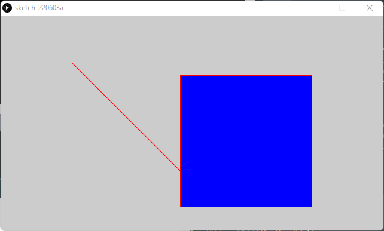

#### text()

La fonction `text()` permet d'afficher un texte dans l'écran de dessin et s'écrit : 

```java
text(texte, x, y);
```

- `texte` : Le texte à afficher
- `x` : La position du texte en abscisse
- `y` : La position du texte en ordonné

Exemple :

```java
size(640, 360);
text("Hello World!", 300, 180);
```

Résultat : 


### Exercice 6

Tout d'abord, établissez une fenêtre de taille 640x360 pixels avec la fonction `size()`.

#### Question 6.1

Afficher un point de couleur rouge au milieu de l'écran.

<details>
	<summary>Réponse</summary>
	R :
	<pre>
		<code>
			size(640, 360);
			stroke(255, 0, 0);
			point(320, 180);
		</code>
	</pre>
</details>


#### Question 6.2

Afficher une ligne horizontale et une ligne verticale placées au milieu de l'écran. Puis placez le point rouge par dessus.

<details>
	<summary>Réponse</summary>
	R :
	<pre>
		<code>
			size(640, 360);
			line(0, 180, 640, 180);
			line(320, 0, 320, 640);
			stroke(255, 0, 0);
			point(320, 180);
		</code>
	</pre>
</details>

#### Question 6.3

Par dessus le sketch de la `question 6.2`, ajouter un cercle bleu avec des bordures noires, un triangle jaune avec des bordures rouges et un carré rose sans bordure. Les trois formes ajoutées ne doivent pas se toucher et ne doivent pas toucher le point rouge du centre.

<details>
	<summary>Réponse</summary>
	R :
	<pre>
		<code>
			size(640, 360);
			line(0, 180, 640, 180);
			line(320, 0, 320, 640);
			fill(0, 0, 255);
			circle(70, 100, 100);
			fill(232, 220, 0);
			stroke(255, 0, 0);
			triangle(250, 100, 200, 300, 300, 300);
			fill(224, 0, 232);
			stroke(0,0,0,0); // ou stroke({même couleur que le fill au dessus});
			square(450, 100, 220);
			stroke(255, 0, 0);
			point(320, 180);
		</code>
	</pre>
</details>

### Fonctions personnalisées

Nous allons maintenant créer une fonction simple nommée `sum` qui va calculer la somme entre deux arguments `a` et `b` : 

```java
int sum(int a, int b) {
	return a + b;
}
```

Testons cette fonction avec trois variables :

```java
int x = 2;
int y = 10;
int z = random(10);
print(z);
print(sum(x, y));
print(sum(x, z));
print(sum(y, z)); 
```

Résultat :

```java
7 // z
12 // x + y
9 // x + z
17 // y + z
```

Nous allons maintenant créer une forme :

Construisons un oeil grâce aux fonctions `ellipse` et `circle`.

```java
void eye(float x, float y) {
	stroke(0, 0, 0, 0);
	ellipse(x, y, 250, 100);
	fill(0, 0, 0);
	circle(x, y, 50);
}
```

Résultat : 

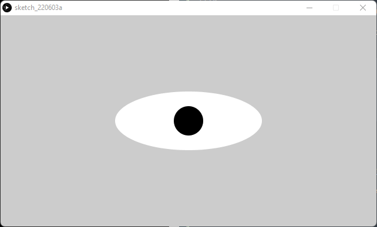

Essayez maintenant de faire apparaitre deux yeux avec la fonction `eye()`.

Vous pouvez voir que le deuxième oeil est apparu en noir, cela est dû à la dernière occurence de la fonction `fill()`, en effet, la dernière couleur de remplissage instauré à Processing est le noir, le traitement des données va donc remplir chacune des prochaines formes en noir.

Pour résoudre ce problème, il suffit d'initialiser la fonction `eye()` avec un `fill(255, 255, 255)` par défaut qui est la couleur blanche. Par suite, nous pouvons aussi effectuer une réinitialisation à la fin de la fonction `eye()`, c'est d'ailleurs, la meilleure pratique :

Initialisation : 

```java
void eye(float x, float y) {
  fill(255, 255, 255); // Initialisation de la couleur
  stroke(0, 0, 0, 0);
  ellipse(x, y, 250, 100);
  fill(0, 0, 0);
  circle(x, y, 50);
}
```

Ré-initialisation en fin de code :

```java
void eye(float x, float y) {
  stroke(0, 0, 0, 0);
  ellipse(x, y, 250, 100);
  fill(0, 0, 0);
  circle(x, y, 50);
  fill(255, 255, 255); // Initialisation de la couleur
  stroke(0, 0, 0, 255); // Initialisation des contours
}
```

L'initialisation sera une action que nous allons devoir répéter pour beaucoup de nos créations et elle nous permet de garder une certaine logique lors de nos créations de formes géométriques dans notre sketch.

Par ce principe, une action répétable contenant plus d'une instruction se doit d'être une fonction !

Créer donc la fonction `init()` prenant aucun argument qui devra initialiser la couleur et les contours des formes.

<details>
	<summary>Réponse</summary>
	R :
	<pre>
		<code>
			void init() {
				fill(255, 255, 255);
				stroke(0, 0, 0, 255);
			}
		</code>
	</pre>
</details>

Très bien ! Maintenant, utilisez cette fonction `init()` dans la fonction `eye()` et testez de faire apparaitre deux yeux comme demandé précédement.

<details>
	<summary>Réponse</summary>
	R :
	<pre>
		<code>
			void setup() {
			  size(640, 360);
			  eye(random(640), random(360));
			  eye(random(640), random(360));
			}
		</code>
		<code>
			void init() {
			  fill(255, 255, 255);
			  stroke(0, 0, 0, 255);
			}
		</code>
		<code> 
			void eye(float x, float y) {
			  stroke(0, 0, 0, 0);
			  ellipse(x, y, 250, 100);
			  fill(0, 0, 0);
			  circle(x, y, 50);
			  init();
			}
		</code>
	</pre>
</details>

Les deux yeux devraient apparaitre sans problème.

Félicitations ! Vous êtes maintenant officiellement un programmeur  Processing Java débutant !

## Mini-projet : Le chat bleu vous suit des yeux! Partie 1

Nous savons que vous voulez en apprendre plus ! Mais on a besoin de vous tout de suite !

Le chef voudrait avoir un dessin fait avec Processing, voici le cahier des charges :

- Une tête de chat bleu (Tête, oreilles, yeux, nez, moustaches, bouche)

Voici à quoi devrait ressembler le chat au final :

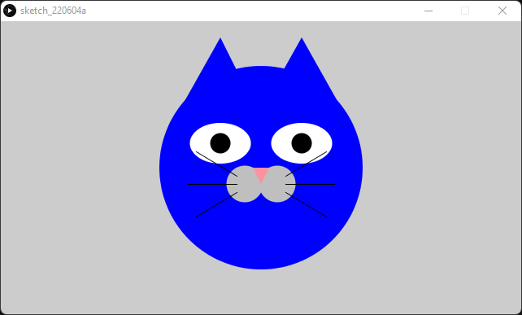

<details>
	<summary>Réponse proposée</summary>
	R :
	<pre>
		<code>
			color c = #0000FF;
			void setup() {
			  size(640, 360);
			  cat(320, 180);
			}
		</code>
		<code>
			void init() {
			  fill(255, 255, 255, 255);
			  stroke(0, 0, 0, 255);
			}
		</code>
		<code>
			void eye(float x, float y) {
			  stroke(0, 0, 0, 0);
			  ellipse(x, y, 75, 50);
			  fill(0, 0, 0);
			  circle(x, y, 25);
			  init();
			}
		</code>
		<code>
			void cat(float x, float y) {
			  stroke(0, 0, 0, 0);
			  fill(c);
			  circle(x, y, 250); // Forme de la tête
			  triangle(225, 100, x-50, y-160, 310, 100); // Oreille gauche
			  triangle(325, 100, x+50, y-160, 415, 100); // Oreille droite
			  // Bouche
			  fill(191, 191, 191);
			  circle(x-20, y+20, 45); // Patrtie gauche de la bouche
			  circle(x+20, y+20, 45); // Partie droite de la bouche
			  // Nez
			  stroke(0, 0, 0, 0);
			  fill(252, 145, 160);
			  triangle(x-10, y, x, y+20, x+10, y);
			  // Yeux
			  fill(255, 255, 255);
			  eye(x-50, y-30);
			  eye(x+50, y-30);
			  //Moustaches
			  stroke(0, 0, 0, 255);
			  // Moustaches de gauche
			  line(x-30, y+10, x-80, y-20);
			  line(x-30, y+20, x-90, y+20);
			  line(x-30, y+30, x-80, y+60);
			  // Moustaches de droite
			  line(x+30, y+10, x+80, y-20);
			  line(x+30, y+20, x+90, y+20);
			  line(x+30, y+30, x+80, y+60);
			}
		</code>
	</pre>
</details>

Vous avez terminé le dessin ? Très bien ! Mais le chef veut maintenant une animation des yeux qui devraient suivre curseur de la souris.

Pour cela, on aura recourt à la programmation orientée objets!

## Programmation Orientée Objets

La Programmation Orientée Objets (POO) est une méthode de programation informatique organisée autour des objets. On appelle objet, un ensemble de variables complexes et de fonctions. Par exemple, une grande partie des types du langage Processing sont en fait des objets !

### Classe

Une classe est un ensemble de code contenant des variables et des fonctions permettant de créer des objets. Par suite, une classe peut contenir plusieurs objets.

#### Définir une classe avec Processing

Pour définir une classe dans Processing on procède comme ci-dessous : 

```java
class Name {
	// Instructions
}
```

Pour pouvoir animer les yeux du chat bleu nous allons créer une classe `Eye` dans un autre sketch :

```java
class Eye { }
```

### Attributs de classe

On appelle `attribut` de classe une variable propre à une `class`.

En reprennant la fonction `eye()` que nous avions créé précédement, on peut transformer les paramètres `x` et `y` de cette fonction en attributs ! 

```java
class Eye {

	float x;
	float y;

}
```

Ici, nous avons déclarer les attributs de la classe `Eye` mais nous n'avons pas assigné de valeur à ces attributs. C'est normal, la déclaration d'attributs dans une classe se fait à titre indicatif des attributs qui la composent.

Mais comment fait on pour appeler une classe ou un objet ? On utilise un `constructeur`.

### Constructeur

Un constructeur est une méthode (fonction contenue dans une classe) qui sert à créer une `instance` de la classe construite.

Une `instance` est un objet construit reprenant les caractéristiques définis par une classe.

On ajoute donc un constructeur à la classe `Eye` : 

```java
class Eye {

	float x;
	float y;

	/**
	 * Constructeur
	 */
	Eye(float tempX, float tempY) {
		x = tempX;
		y = tempY;
	}
}
```

Le construteur `Eye` se doit d'avoir le même nom que sa classe associé et nous n'avons pas besoin de spécifier son type lors de sa définition.

### Méthode

Une méthode est une fonction contenue dans une classe.

Maintenant nous devons pouvoir créer l'oeil comme nous l'avions fait précédement, pour cela, nous allons créer trois méthodes, `initColors()` qui va réinitialiser les couleurs de remplissage et de contours des formes, `updatePos()` qui va mettre à jour la position de la pupille de l'oeil et `display()` qui contiendra toutes les formes géométriques utilisées : 

```java
class Eye {

  int x;
  int y;
  float angle;

  Eye(int tempX, int tempY) {
    x = tempX;
    y = tempY;
    angle = 0.0;
  }

  // Méthodes

  void initColors() {

  }

  void updatePos(int movX, int movY) {

  }

  void display() {

  }
}
```

## Mini-projet : Le chat bleu vous suit des yeux ! Partie 2

A vous de créer l'animation des yeux ! Aidez vous de la documentation Processing cet [exemple](https://processing.org/examples/arctangent.html).

<details>
	<summary>Solution</summary>
	R : 
	<pre>
		<code>
		class Eye {
		</code>
		<code>
		  int x;
		  int y;
		  float angle;
	  	</code>
		<code>
		  Eye(int tempX, int tempY) {
		    x = tempX;
		    y = tempY;
		    angle = 0.0;
		  }
		</code>
		<code>
		  // Méthodes
	 	</code>
		<code>
		  void initColors() {
		    fill(255); // Remplissage en blanc
		    stroke(0); // Contours noirs
		  }
		</code>
		<code>
		  void updatePos(int movX, int movY) {
		    angle = atan2(movY-y, movX-x); // Mouvements de l'oeil
		  }
		</code>
		<code>
		  void display() {
		    pushMatrix(); // Sauvegarde les données initiales
		    noStroke(); // Supprime les contours
		    translate(x,y); // Déplace les formes suivantes
		    fill(255); // Remplissage en blanc
		    ellipse(0, 0, 75, 50); // Partie blanche de l'oeil
		    rotate(angle); // Rotation de la prochaine forme
		    fill(0); // Remplissage en noir
		    circle(25/4, 0, 25); // Pupille
		    initColors(); // Ré-initialisation des couleurs en fin de code
		    popMatrix(); // Restaure les données initiales
		  }
		}
		</code>
	</pre>
</details>

Résultat : 


Félicitations ! Vous êtes maintenant un programmeur Processing ayant des compétences en programation orientée objets ! 

Ceci conclu la partie "Introduction à Processing" de la formation Processing, n'hésitez pas à ouvrir un "problème" sur le [repository GitHub associé](https://github.com/greg-ynx/Formation-Processing) si vous avez une question concernant des notions sur Processing.

## Projet final : Pong 